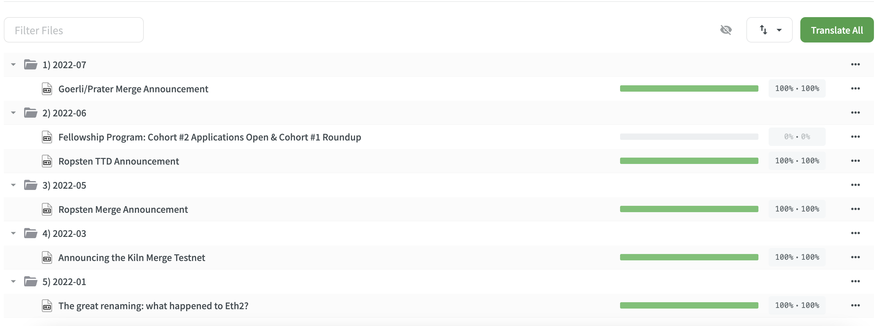
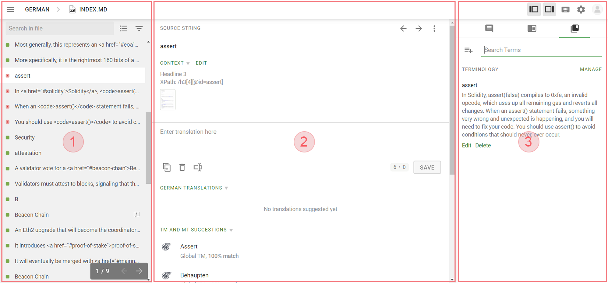

# EF blog translations {#blog-translations}

The [Ethereum Foundation blog](https://blog.ethereum.org/) is the primary publication tool for a lot of EF-supported teams. Several teams regularly use the blog to publish announcements, updates, reports, roundups, and other public communication.

In line with some key values from the ethereum.org Translation Program mission and vision, [ethereum.org Translation Program mission and vision](/contributing/translation-program/#mission-and-vision) - accessibility, inclusivity, empowerment, and building the global Ethereum community - we want to translate the Ethereum Foundation blog posts in as many languages as possible.

The blog translation project is open and anyone can contribute.
If you want to get involved and help translate blog posts into your language, read on to learn how to join the project in Crowdin and start translating.

## How to translate {#how-to-translate}

<InfoBanner shouldCenter emoji=":light_bulb:">
  We encourage you to check out the ethereum.org Translation style guide. It contains some of the most important guidelines, instructions, and tips for translators to help localize the blog. While originally written for ethereum.org translators, most of the style guide is relevant to blog translations as well.
  {" "}<Link to="/contributing/translation-program/translators-guide/">View the Translation Style Guide</Link>
</InfoBanner>

1. **[Join the blog translations project on Crowdin](https://crowdin.com/project/ethereum-foundation-blog)**  
   You will need to log in to your Crowdin account or sign up if you don’t already have one. All that is required to sign up is an e-mail account and password.

2. **Open the language you want to translate and find a blog post to work on**  
   Each blog post is uploaded to Crowdin as an individual file. The files are named after the blog post title, so finding a specific post that you want to translate should be fairly straightforward. You can check the progress of each document on the right – if translation progress is below 100%, please contribute!

   

3. **Translate**  
   After selecting the file you want to translate, it will open in the online editor. If you have never used Crowdin before, you can use this quick guide to go over the basics.

   

   **_1 – Left sidebar_**

   - Untranslated (red) – text that has not been worked on yet. These are the strings that you should be translating.
   - Translated (green) – text that has already been translated, but not yet reviewed. You are welcome to suggest alternate translations, or vote on existing ones using the ‘’+’’ and ‘’-‘‘ buttons in the editor.
   - Approved (check mark) – text that has already been reviewed and is currently live on the website.

   You can also use the buttons on top to search for specific strings, filter them by status or change the view.

   **_2 – Editor area_**

   The main translation area – source text is displayed on top, with additional context and screenshots, if available.
   To suggest a new translation, enter your translation in the ‘’Enter translation here’’ field and click Save.

   You can also find existing translations of the string and translations into other languages in this section, as well as translation memory matches and machine translation suggestions.

   **_3 – Right sidebar_**

   This is where you can find comments, translation memory entries and glossary entries. The default view shows the comments and allows translators to communicate, raise issues or report incorrect translations.

   By using the buttons on top, you can also switch to the Translation Memory, where you can search for existing translations, or to the Glossary, which contains descriptions and standard translations of key terms.

   Want to learn more? Feel free to check out the [documentation on using the Crowdin online editor](https://support.crowdin.com/online-editor/)

4. **Review process**  
   Once you've completed the translation (i.e. a specific blog post is 100% translated), our professional translation service will review (and potentially edit) the content. Once the review is complete (i.e. review progress is 100%), we will add your translation to the blog.

<InfoBanner shouldCenter emoji=":warning:">
  Please do not use machine translation to translate the project. All the translations will be reviewed before being added to the blog. If your suggested translations are found to be machine translated, they will be dismissed and contributors who use machine translation often will be removed from the project.
</InfoBanner>

Do you have any questions? Or want to collaborate with our team and other translators? Please post in the #translations channel of our [ethereum.org Discord server](https://discord.gg/6WX7E97)

You can also reach out to us at translations@ethereum.org

Thank you for your getting involved and helping us make the Ethereum Foundation blog accessible to everyone!